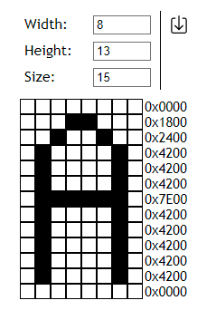
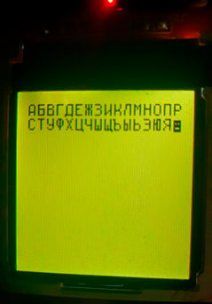

# HexImageCreator
**HexImageCreator** - web application is an intuitive tool for creating images in hexadecimal format.

**Features of HexImageCreator:**
1. Web application. Stack (html, css, javascript) in one file index.html without unnecessary installations and other nonsense.
2. HexImageCreator is compatible with various display modules, including ST7735, ILI9163 and many others.
3. The application makes it easy to generate images in hexadecimal format based
on the set parameters, which makes it an ideal tool for developers and enthusiasts.
4. HexImageCreator has a simple and intuitive user
interface that simplifies the process of creating images.
5. Users can customize various parameters, size, width, height and other characteristics.

---

 

&nbsp;&nbsp;&nbsp;&nbsp;&nbsp;&nbsp;

---

**HexImageCreator** - интуитивно понятный инструмент для создания изображений в шестнадцатеричном формате.

**Особенности HexImageCreator:**
1. Веб-приложение. Стек (html, css, javascript) одним файлом index.html без лишних установок и прочей ерунды.
2. HexImageCreator совместим с различными дисплейными модулями, включая ST7735, ILI9163 и многие другие.
3. Приложение позволяет легко генерировать изображения в шестнадцатеричном формате на основе 
заданных параметров, что делает его идеальным инструментом для разработчиков и энтузиастов.
4. HexImageCreator имеет простой и понятный пользовательский 
интерфейс, который упрощает процесс создания изображений. 
5. Пользователи могут настраивать различные параметры, размер, ширина, высота и другие характеристики.